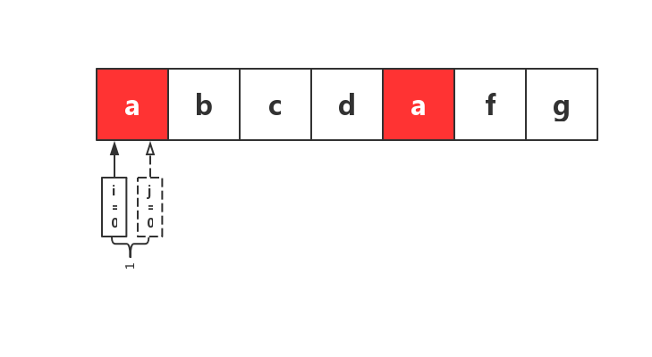
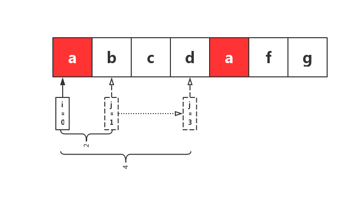
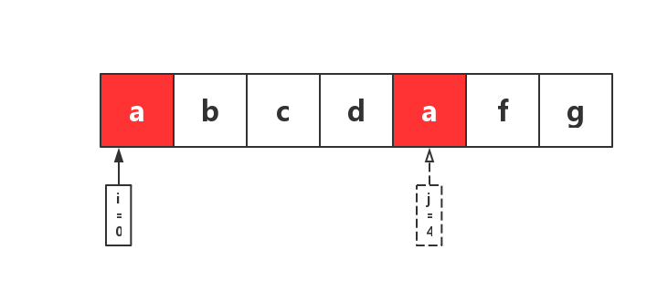
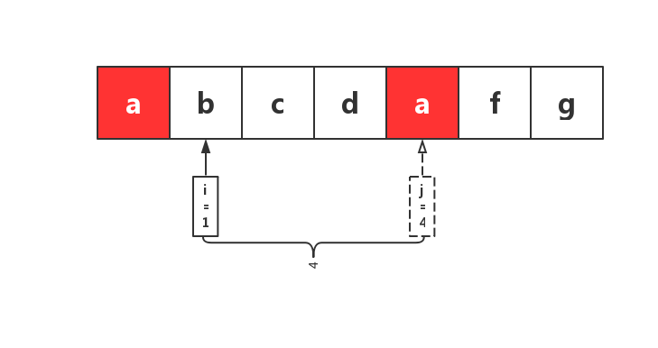
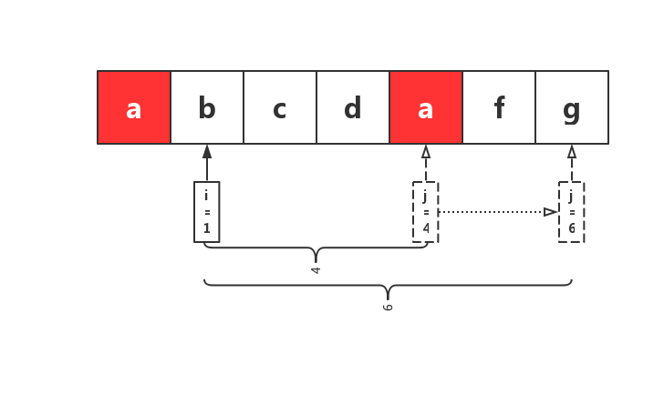

# 滑动窗口

假设原始字符串**S**如下

从左侧开始遍历**S**，以`i`标记窗口左侧，`j`标记窗口右侧，初始时，`i=0`，`j=0`，即开头**a**所在的位置，此时，窗口大小为**1**

然后，将`j`右移，逐步扩大窗口，依次经过**b**、**c**、**d**，此时，窗口内均无重复字符，继续右移`j`

当`j`移动到`d`后面的`a`所在位置时，对应字符`a`在窗口中**已存在**，此时，窗口大小为5，去除当前重复的一位，窗口大小为**4**。此时窗口内的字符串`abcd`为

找到窗口中已存在的该字符所在位置，并将`i`移动到该位置下一位

此时为第二个窗口

继续重复之前的操作，直到`j`移动到字符串最后一位停止。
* questions:
    * [3. Longest Substring Without Repeating Characters 没有重复字符的最长子串](https://leetcode.com/problems/longest-substring-without-repeating-characters/)
    * [1425. Constrained Subsequence Sum 约束子序列总和](https://leetcode.com/problems/constrained-subsequence-sum/)
    * [1438. Longest Continuous Subarray With Absolute Diff Less Than or Equal to Limit 绝对差小于或等于限制的最长连续子数组](https://leetcode.com/problems/longest-continuous-subarray-with-absolute-diff-less-than-or-equal-to-limit/)